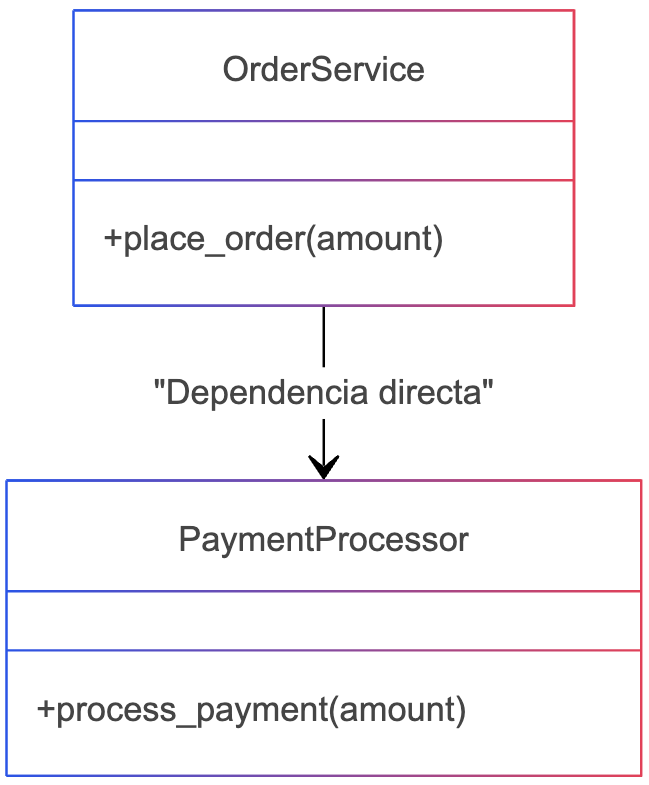
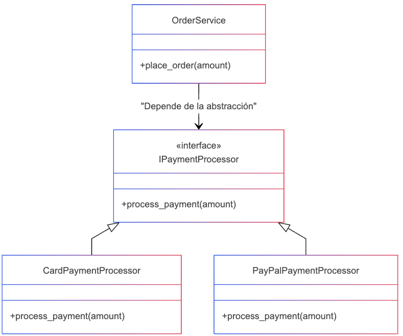

# Patrón indirection
## 📌 Definición
El patrón de Indirection (Indirección) introduce una capa intermedia entre dos componentes para reducir el acoplamiento directo y mejorar la flexibilidad y mantenibilidad del sistema.

## 📌 Cuándo se usa?
Se usa cuando dos componentes están muy acoplados y queremos desacoplarlos para mejorar la escalabilidad y facilitar cambios futuros.

## Ejemplos de uso:
- 🔹 Cuando un cliente accede directamente a una base de datos, podemos interponer un repositorio.
- 🔹 Cuando dos clases dependen una de otra, podemos usar una interfaz intermedia.
- 🔹 Para aplicar el Principio de Inversión de Dependencias (DIP).

## 📌 Por qué se usa?
Para evitar dependencias directas entre los componentes del sistema, permitiendo:
- ✅ Flexibilidad al cambiar implementaciones.
- ✅ Reutilización de código sin modificar muchas partes del sistema.
- ✅ Facilidad de pruebas unitarias, ya que podemos sustituir dependencias con mocks.

## 📌 Qué beneficios trae?
- ✔ Reduce el acoplamiento entre clases.
- ✔ Hace que el código sea más modular y fácil de mantener.
- ✔ Permite reemplazar implementaciones sin afectar al código cliente.

## 📌 Qué problemas trae?
- ❌ Aumenta la complejidad si se abusa del patrón.
- ❌ Puede hacer el código más difícil de leer si se introducen demasiadas capas innecesarias.

## 📌 Cómo se complementa con otros principios?
- 🔹 DIP (Principio de Inversión de Dependencias): Indirection permite que las clases dependan de abstracciones en lugar de implementaciones concretas.
- 🔹 ISP (Principio de Segregación de Interfaces): Indirection puede ayudar a dividir interfaces grandes en múltiples interfaces pequeñas.
- 🔹 OCP (Principio de Abierto/Cerrado): Permite extender el sistema agregando nuevas implementaciones sin modificar código existente.

## Diagrama violentando el patrón indirection

## Diagrama aplicando el patrón indirection
